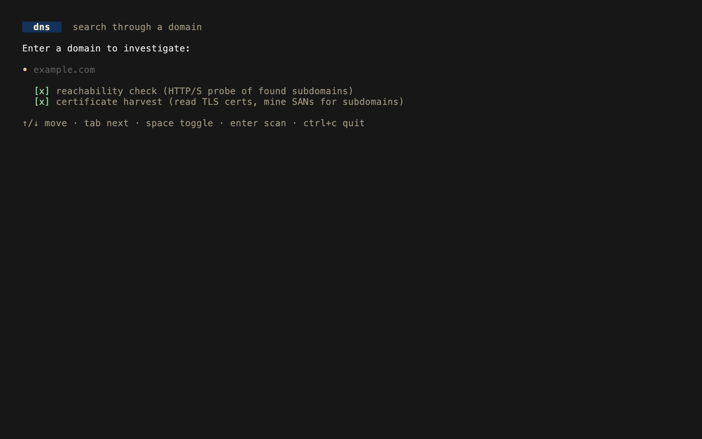
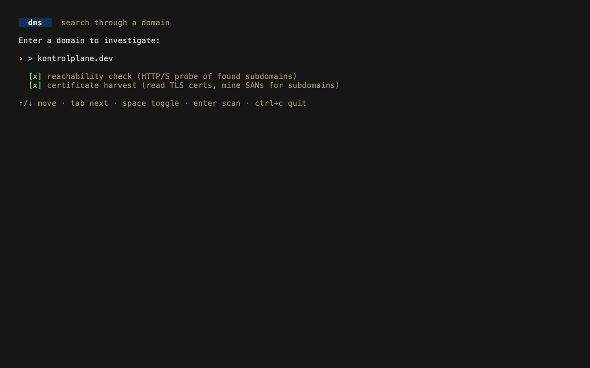
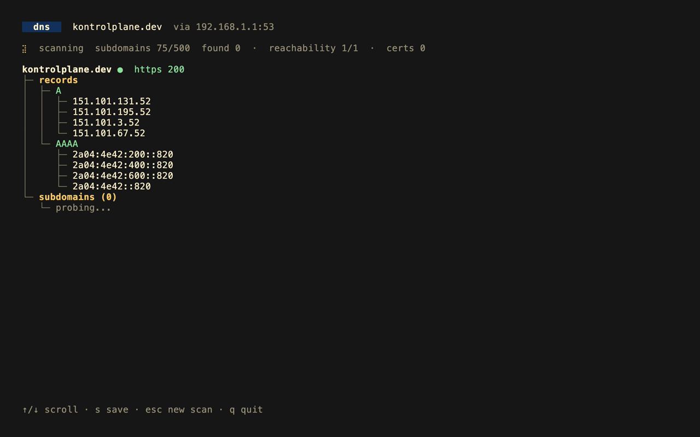
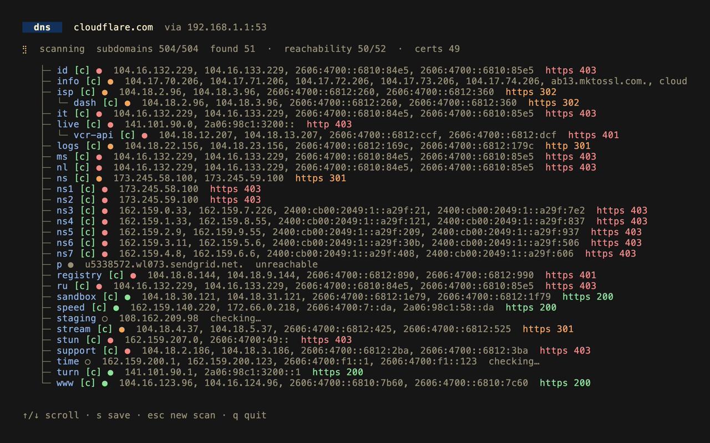

<p align="center">
  <h1 align="center">dns</h1>
</p>

`dns` is a terminal user interface (tui) application that takes a domain name and queries out everything it can find - DNS records across all common types plus live subdomain enumeration — into a single navigable view. Results stream in live as queries complete, making it a fast way to investigate the surface area of any domain directly from the terminal.

## usage

```bash
dns
```

```bash
dns example.com
```

Queries use the system's configured nameserver (from `/etc/resolv.conf`), falling back to `1.1.1.1`. Override the upstream nameserver with `-ns`:

```bash
dns -ns 8.8.8.8 example.com
```

## demonstration

`live scan`
<p align="center">
  
</p>

`input screen`
<p align="center">
  
</p>

`dns records`
<p align="center">
  
</p>

`subdomains`
<p align="center">
  
</p>

## what it shows

- DNS records: A, AAAA, CNAME, MX, NS, TXT, SOA, SRV, CAA, PTR for the apex domain.
- Sub-domains: probes ~500 common hostnames concurrently and lists those that resolve, with their addresses (and any CNAME chain).

## development

- [go](https://go.dev/) 1.26+

```bash
go build -o dns . && ./dns example.com
```

To show the changes made in the repository readme, the following command can be ran which automatically creates the preview gif & screenshots:

```bash
vhs vhs/cassette.tape
vhs vhs/screenshots.tape
```

## keybindings

- `enter`: start scan (input screen)
- `tab`: toggle reachability check (input screen)
- `↑`, `↓`: scroll results
- `s`: save results to a JSON file
- `esc`: new scan
- `q`, `ctrl+c`: quit

## contributors

<a href="https://github.com/levivannoort"></a>
